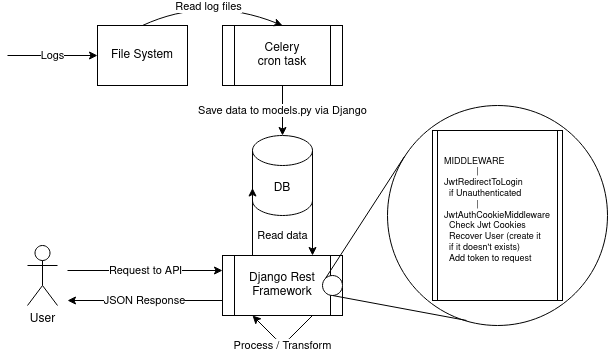
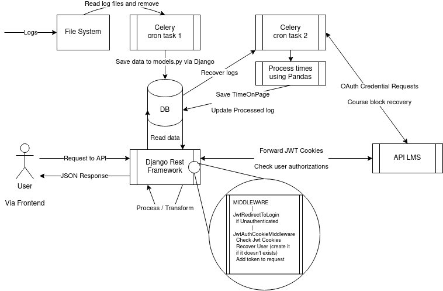

# Backend Documentation

The data from a course is fetched from the filesystem using Celery cron tasks. This processes the logs and saves different metrics to the Django DB.

The diagram shows the basic flow of information on the backend app:

Once a request arrives, it passes through the middlewares and checks:
* Presence of the USE-JWT-COOKIE HTTP header.
* Both header-payload and sign cookies
* Recovers the JWT Token and decodes it
* Recovers the user from the JWT payload
* Goes to the particular view

Some views must check that the current user has permissions over the data. This is already checked client-side but acts as a failsafe to ensure the user has access only to the courses where it has some authority, i.e. a student shouldn't be able to asks for its peers information. This check is done by forwarding a request from the view, caching the response and checking permissions. 

Note: To send the request from a view we have to remove the recovered cookie.

## Loading logs
For the creation of metrics it is necessary to load the activity of the users of a specific course from a file. For this, the file must be located in a folder and the task **load_logs** must be called. The default folder is called *logs* and is located inside of the *back* directory.

There is an inverse task called **downloadlogs** which saves the logs in a file.

## Processing metrics
Loading logs and computing user page times statistic.

After data logs are procesed, another tasks (like tasks 2) recovers the info, ask for complementary data at the LMS API and processes times saving them to the database. This info retrieval process is selective according to the desired statistic.

Among the different existing metrics are the time users have spent on the pages (*TimeOnPage*), the number of visits they have made (*VisitOnPage*) and the activity they have had on the video components (*ViewOnVideo*). Each of these can be loaded by calling its corresponding task: **processtimes**, **processvisits** and **processviews** respectively. 

In addition, there are tasks **processcompletion** and **processcoverage**. The first one creates the metric of how many components have been completed by the users. The second one calculates the user coverage of the videos.

### Course structure
The first action that is performed for the creation of a specific metric is the identification and creation of the course structure. To do this, and using the previously loaded logs, the course components (represented by *CourseVertical*) are inactivated, i.e. they change their *is_active* field to false. The purpose is to distinguish and filter the statistics associated with recent content that is still being displayed in the course. After that, new course components are saved and existing ones are updated.

### Creating desired statistic
For the creation of the desired statistics, the related information stored in the database is deleted.

In the specific case of video metrics, during its creation process the *Video* and *Segment* tables are also created. When a new video *Segment* is created/modified/deleted, the *Video* viewed modifies its *watch_time* field automatically. Conversely, to update the *coverage* field of the videos of a course, it is necessary to call *processcoverage* task, mentioned above.

## List of students
There is an additional Celery task called **loadusers**. This one does not need the information stored through the logs, getting all the information from the LMS API.
